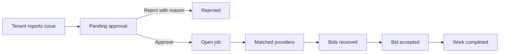
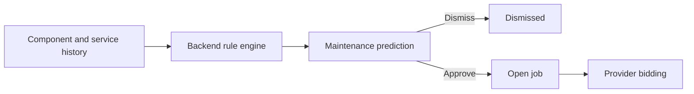
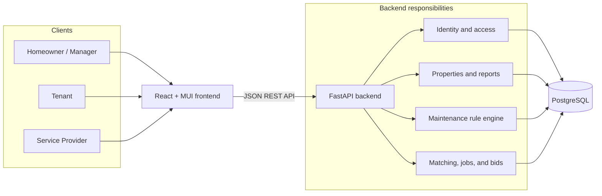
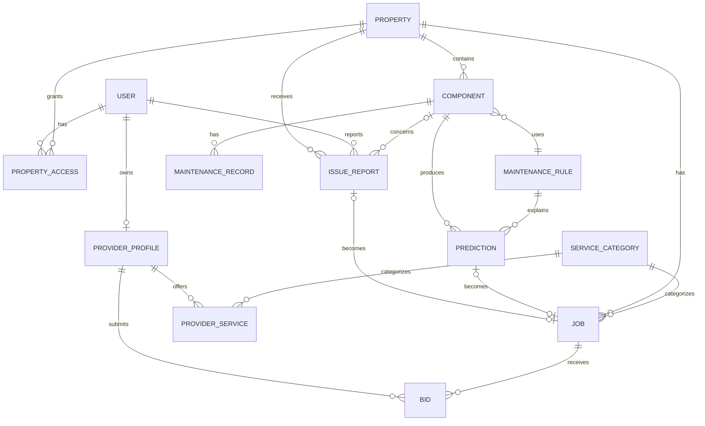

# Agentic Property Manager

Agentic Property Manager is a proof-of-concept platform for reporting property issues, forecasting routine maintenance, approving work, matching service providers, and collecting bids.

The first version proves a small closed loop:

1. A tenant or property owner reports an issue, or the system predicts scheduled maintenance.
2. The homeowner or property manager reviews and approves the work.
3. The backend creates a job and matches qualified providers.
4. Providers bid for the job.
5. The homeowner or manager accepts one bid and tracks the work.

Authentication is intentionally simple for the PoC: email sign-in, one account role per user, and no production identity verification.

## Product principles

- Keep the scope small enough to demonstrate in four hours.
- Put validation, authorization, state changes, predictions, matching, and pricing rules in the backend.
- Keep the frontend focused on forms, API calls, and presenting server responses.
- Use predefined, explainable maintenance rules instead of an LLM or trained model.
- Require a human to approve tenant reports and predicted work before providers can bid.
- Never expose tenant details or an exact residential address in the public provider job feed.

## Users and use cases

| User | Main use cases | What they cannot do |
| --- | --- | --- |
| Tenant | Sign in, see their assigned property, report an issue, optionally select a component, set urgency, and track report/job status | Approve reports, publish jobs, view bids, select providers, or edit the property |
| Homeowner | Create and manage owned properties, assign tenants/managers, maintain components and service history, report issues, approve or reject reports, review predictions, publish jobs, review bids, and accept a bid | Manage properties they do not own or manage |
| Property manager | Perform the homeowner maintenance workflow for assigned properties, including report approval and bid selection | Access unassigned properties or change legal ownership |
| Service provider | Create and update a service profile, choose service categories and coverage areas, view matched jobs, submit/update/withdraw a bid, and see awarded work | See private tenant information, approve reports, or bid outside configured services |

### Tenant report flow



The tenant sees progress but not provider bids. A homeowner or manager may report an issue too; their report can be approved immediately and published as a job after confirmation.

### Planned maintenance flow



## Do we need an LLM?

No. An LLM adds cost, latency, non-deterministic output, and more work to validate without improving the core demo. The PoC will use predefined rules that are easy to test and explain:

- Each component category has a service interval, warning window, and default estimated cost.
- The next due date is the latest completed service date plus the configured interval. If no service exists, use the component installation date.
- A prediction becomes `overdue`, `due_soon`, or `upcoming` based on the configured warning window.
- Estimated cost uses recent completed maintenance for that component/category, falling back to the rule's default cost.
- Users explicitly choose an issue category. CSV imports use fixed column mappings and a small keyword-alias table, with unknown rows sent back for user correction.
- Only the backend evaluates these rules; the frontend displays the result and explanation returned by the API.

An LLM can be reconsidered later for optional free-text extraction, but it is not part of this PoC.

## Architecture



The API is authoritative. The UI must not decide whether a report can be approved, calculate maintenance dates, match providers, or determine valid status transitions. It sends user intent to the API and renders the returned state.

## Data schema



### Core entities

| Entity | Important fields |
| --- | --- |
| `users` | `id`, `email`, `name`, `role`, timestamps |
| `properties` | `id`, `name`, address fields, suburb/city, timestamps |
| `property_access` | `property_id`, `user_id`, `access_role` (`owner`, `manager`, `tenant`) |
| `components` | `id`, `property_id`, `category`, `name`, `installed_on`, condition |
| `maintenance_rules` | component category, interval months, warning days, default cost, description |
| `maintenance_records` | component, completed date, cost, provider/notes |
| `predictions` | component, rule, due date, estimated cost, urgency, explanation, status |
| `issue_reports` | property, optional component, reporter, category, title, description, urgency, status, review reason |
| `jobs` | property, service category, optional source report/prediction, description, budget, status, approved by/at |
| `provider_profiles` | user, business name, description, phone, suburb/city, radius, rating |
| `provider_services` | provider profile, category, active flag |
| `bids` | job, provider, amount, message, available date, status, timestamps |

Database constraints should ensure unique user emails, one property membership per user/property, one provider service per category, one bid per provider/job, and at most one job for a source report or prediction.

## Job and report states

- Report: `pending_approval -> approved -> converted_to_job`, or `pending_approval -> rejected`.
- Prediction: `active -> approved -> converted_to_job`, or `active -> dismissed`.
- Job: `open -> awarded -> in_progress -> completed`, with `open -> cancelled` allowed.
- Bid: `submitted -> accepted` or `submitted -> withdrawn/rejected`.

The backend owns all state transitions and records who approved, rejected, or accepted each action.

## Repository structure

```text
agentic_property_manager/
|-- backend/                    # FastAPI, domain logic, rules, persistence
|   `-- README.md               # Backend design and tickets
|-- frontend/                   # React, TypeScript, and MUI UI
|   `-- README.md               # Frontend design and tickets
|-- dev.docker-compose.yaml     # Local hot-reload development stack
`-- README.md                   # Product scope, use cases, schema, and plan
```

## Four-hour build plan

### Hour 1 - foundation

- [ ] **BE-01:** Bootstrap FastAPI, configuration, health endpoint, and PostgreSQL.
- [ ] **BE-02:** Add the minimal schema and seed maintenance/service categories.
- [ ] **FE-01:** Bootstrap React, TypeScript, MUI, routing, and the API client.
- [ ] **DEV-01:** Start all services with the development Compose file.

### Hour 2 - identity, properties, and reports

- [ ] **BE-03:** Implement demo email onboarding and property-scoped authorization.
- [ ] **BE-04:** Implement properties, memberships, components, and maintenance history.
- [ ] **BE-05:** Implement issue reporting plus owner/manager approval and rejection.
- [ ] **FE-02:** Build sign-in/onboarding and role-aware navigation.
- [ ] **FE-03:** Build property workspace, tenant report form, and approval queue.

### Hour 3 - rules and marketplace

- [ ] **BE-06:** Implement explainable rule-based maintenance predictions.
- [ ] **BE-07:** Convert approved reports or predictions into jobs.
- [ ] **BE-08:** Implement provider profiles, matching, jobs, and bidding.
- [ ] **FE-04:** Build predictions and job approval screens.
- [ ] **FE-05:** Build provider profile, matched job feed, and bid form.

### Hour 4 - closed-loop demo

- [ ] **FE-06:** Build owner/manager bid review and bid acceptance.
- [ ] **BE-09:** Add seed data and happy-path API tests.
- [ ] **FE-07:** Add loading, empty, validation, and error states.
- [ ] **DEV-02:** Reset, rehearse, and document the demo.

Detailed acceptance criteria are in [backend/README.md](backend/README.md) and [frontend/README.md](frontend/README.md).

## Run locally

Once the implementation files and Dockerfiles described in the tickets exist:

1. Create local configuration from the committed template if `.env` is not already present:

   ```powershell
   Copy-Item .env.example .env
   ```

2. Change the database password, exposed ports, `HOST`, or `PROTOCOL` in `.env` as needed. Compose derives the frontend origin and public API URL from these values. When moving to a VM, set `HOST` to its public IP address or DNS name; do not change the containers' `0.0.0.0` bind address.

3. Start the development stack:

   ```bash
   docker compose -f dev.docker-compose.yaml up --build
   ```

- Frontend: <http://localhost:5173>
- Backend API: <http://localhost:8000>
- API documentation: <http://localhost:8000/docs>

The development stack mounts both source directories so Vite and Uvicorn reload after file changes.

Docker Compose automatically reads the root `.env`. It supplies PostgreSQL credentials and development configuration to the appropriate containers. `.env` is ignored by Git; `.env.example` documents the required variables and contains no real credentials. Only `VITE_` variables are exposed to browser code.

## Demo script

1. Sign in as a tenant, open the assigned property, and report a leaking pipe.
2. Sign in as its property manager, review the pending report, and approve it as a plumbing job.
3. Also show a rule-generated upcoming maintenance prediction and its explanation.
4. Sign in as a service provider, update the plumbing service profile, view the matched job, and bid.
5. Return to the manager, compare bids, accept one, and show the updated job status.

The story is: **report or predict -> approve -> match -> bid -> get it done.**
